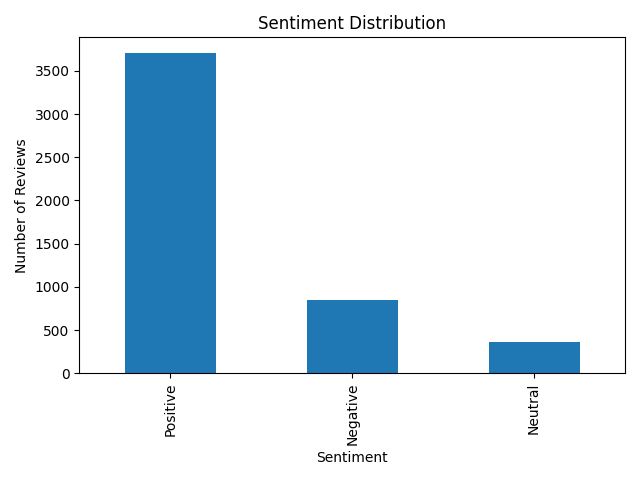
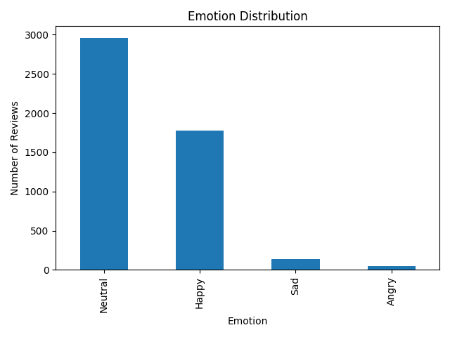
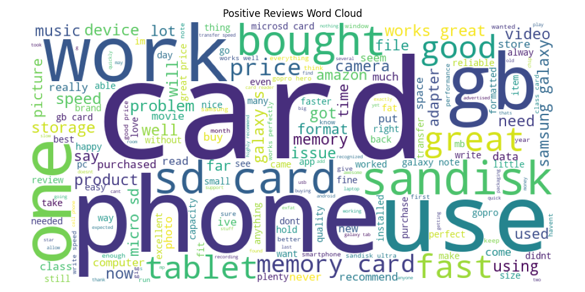
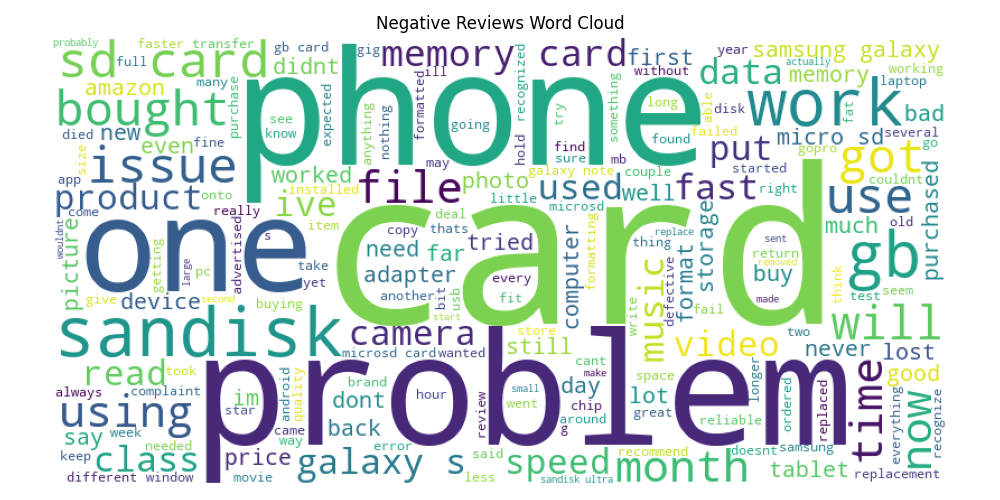

# 📊 Sentiment & Emotion Analysis of Amazon Product Reviews

## 📌 Project Overview
This project applies **Natural Language Processing (NLP)** techniques to analyze **Amazon product reviews** and classify them by:
- **Sentiment** (Positive, Negative, Neutral)
- **Emotion** (Happy, Angry, Sad, Neutral)

The goal is to understand **customer opinions, emotional responses, and public perception trends**, and to demonstrate how such insights can support **business decision-making**.

All visualizations generated during analysis are **automatically saved** in the `visualizations/` folder.

---

## 🛠️ Tools & Technologies
- **Python**
- **Pandas** – data handling
- **NLTK (VADER)** – sentiment analysis
- **Lexicon-based emotion detection**
- **Matplotlib** – data visualization
- **WordCloud** – text visualization

---

## 🔄 Project Workflow
1. Load and clean Amazon review text data  
2. Perform sentiment analysis using **VADER**  
3. Detect emotions using predefined **emotion lexicons**  
4. Generate visualizations and save them automatically  
5. Interpret sentiment and emotional trends  

---

## 📈 Visualizations & Insights

### 📊 Sentiment Distribution


**Interpretation:**
- The majority of reviews fall under **Positive sentiment**, indicating general customer satisfaction.
- A noticeable portion of **Negative reviews** suggests areas where the product or service fails to meet expectations.
- **Neutral reviews** are mostly descriptive and informational.

**Business Insight:**
> Positive sentiment dominance suggests strong product-market fit, while negative sentiment highlights areas for quality improvement.

---

### 😊😡😢 Emotion Distribution


**Interpretation:**
- **Happy** emotions dominate, aligning with positive sentiment results.
- **Angry** emotions are present and often linked to strong dissatisfaction.
- **Sad** emotions indicate disappointment rather than rage, often tied to unmet expectations.

**Business Insight:**
> Angry emotions may require urgent customer support action, while sad emotions indicate opportunities for product refinement.

---

### ☁️ Word Cloud – Positive Reviews


**Interpretation:**
- Common words such as *great*, *excellent*, *love*, and *amazing* appear frequently.
- Highlights features and experiences customers appreciate most.

**Business Insight:**
> These keywords can be leveraged in **marketing campaigns**, product descriptions, and testimonials.

---

### ☁️ Word Cloud – Negative Reviews


**Interpretation:**
- Frequently occurring words include *bad*, *worst*, *disappointed*, and *useless*.
- Indicates recurring pain points and product failures.

**Business Insight:**
> Repeated negative keywords signal **systemic issues** that product teams should prioritize fixing.

---

## 🧠 Key Insights Summary
- Overall customer sentiment is **largely positive**
- Emotional analysis provides deeper understanding beyond sentiment alone
- Negative emotions highlight actionable improvement areas
- Word clouds reveal **customer language**, useful for branding and UX improvements

---

## ▶️ How to Run the Project
```bash
pip install -r requirements.txt
python main.py
